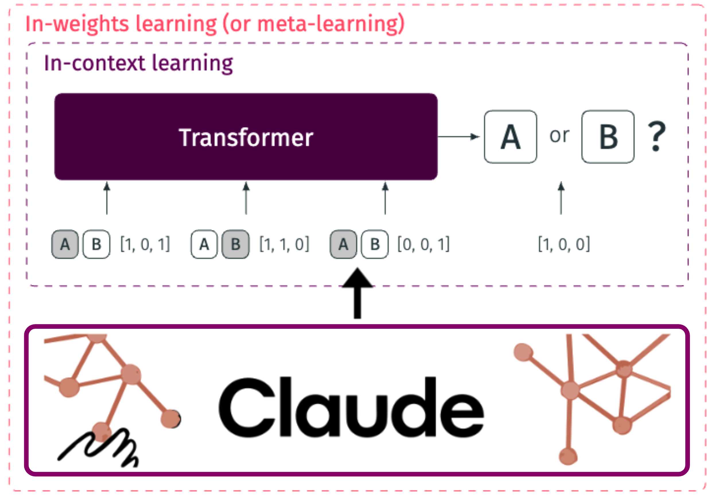

[](https://arxiv.org/abs/2402.01821) 


# Human-like Category Learning by Injecting Ecological Priors from Large Language Models into Neural Networks
This repository contains the code for the project Human-like category learning by injecting ecological priors from large language models into neural networks. 


<p align="center">
  
</p>

## Abstract
Ecological rationality refers to the notion that humans are rational agents adapted to their environment. However, testing this theory remains challenging due to two reasons: the difficulty in defining what tasks are ecologically valid and building rational models for these tasks. In this work, we demonstrate that large language models can generate cognitive tasks, specifically category learning tasks, that match the statistics of real-world tasks, thereby addressing the first challenge. We tackle the second challenge by deriving rational agents adapted to these tasks using the framework of meta-learning, leading to a class of models called ecologically rational meta-learned inference (ERMI). ERMI quantitatively explains human data better than seven other cognitive models in two different experiments. It additionally matches human behavior on a qualitative level: (1) it finds the same tasks difficult that humans find difficult, (2) it becomes more reliant on an exemplar-based strategy for assigning categories with learning, and (3) it generalizes to unseen stimuli in a human-like way. Furthermore, we show that ERMI's ecologically valid priors allow it to achieve state-of-the-art performance on the OpenML-CC18 classification benchmark.


## Project Structure

```bash
.
├── categorisation
│   ├── baselines # baseline models: GCM, Prototype, Rule, Rulex, and LLM
│   │   ├── gcm.py # Generalized Context Model
│   │   ├── llm.py # Claude-v2 as a cognitive model
│   │   ├── pm.py # Prototype Model
│   │   ├── rulex.py # Rulex model 
│   │   ├── run_gcm.py # run GCM
│   │   ├── run_llm.py # run LLM
│   │   ├── run_pm.py # run PM
│   │   ├── run_rulex.py # run Rulex
│   │   └── simulate_llm.py # simulate data from LLM
│   ├── benchmark 
│   │   ├── eval.py # evaluate ERMI and other baseline models on OpenML-CC18 benchmark
│   │   └── save_eval_data.py # save openml-cc18 data for evaluation in a format used by Hollman et al. 2022 
│   ├── data # contains directories with data and results
│   │   ├── benchmark # results from benchmarking
│   │   ├── fitted_simulation # simulate data from MI models using parameters fitted to humans
│   │   ├── generated_tasks # generated tasks from LLM, synthetic, and OpenML-CC18
│   │   ├── human # human data from the three experiments
│   │   ├── llm # data from large language models
│   │   ├── meta_learner # simulate data from metalearned inference models
│   │   ├── model_comparison # results from model comparison
│   │   ├── stats # statistics from generated tasks
│   │   └── task_labels  # LLM synthesized problems
│   ├── mi # train, evaluate, and simulate meta-learned inference models: ERMI, MI and PFN
│   │   ├── baseline_classifiers.py # baseline classifiers
│   │   ├── envs.py # environment classes
│   │   ├── evaluate.py # evaluation functions
│   │   ├── fit_humans.py # fit human data to MI models
│   │   ├── fitted_simulations.py # simulate data from MI, ERMI and PFN models using parameters fitted to humans
│   │   ├── human_envs.py # environment classes simulating human experiments
│   │   ├── model.py # model classes
│   │   ├── model_utils.py # utility functions for models
│   │   ├── simulate_johanssen2002.py # simulate data from Johanssen et al. 2002
│   │   ├── simulate_mi.py # simulate data for different experiments from ERMI, MI and PFN models
│   │   ├── simulate_shepard1961.py # simulate data from Shepard et al. 1961
│   │   └── train_transformer.py # train ERMI, MI and PFN models
│   ├── task_generation # category learning tasks from large language models, synthetic tasks, and OpenML-CC18 tasks
│   │   ├── generate_linear_data.py # generate category learning tasks with linear decision boundaries
│   │   ├── generate_real_data.py # save category learning tasks from OpenML-CC18 benchmark
│   │   ├── generate_synthetic_data.py # generate synthetic category learning tasks
│   │   ├── generate_tasklabels.py # generate task labels for LLM synthesized problems
│   │   ├── generate_tasks.py # generate category learning tasks from large language models
│   │   ├── parse_generated_tasks.py # parse generated tasks from large language models
│   │   ├── prompts.py # prompts for large language models to generate category learning tasks
│   │   └── utils.py
│   ├── trained_models  # trained ERMI, MI and PFN models
│   ├── make_plots.py # replicate plots used in the paper
│   ├── plots.py # plot functions
│   └── utils.py
├── figures # all figures used in the paper
├── scripts # bash scripts for running experiments
├── notebooks # jupyter notebooks for playing around with data, benchmarking...
├── logs # log files from running experiments
└── README.md

```

The project also contains an .env file for storing environment variables and a requirements.txt file for installing the required Python libraries.

## Getting Started
These instructions will get you a copy of the project up and running on your local machine for development and testing purposes.


### Installation
Clone the repository to your local machine. Then, install the required Python libraries from `requirements.text` and install the ermi package using pip:
    
```bash
git clone https://github.com/akjagadish/ermi.git
cd ermi
pip install -r requirements.txt
pip install .
```

### Configuration
The project uses a configuration file called .env to store environment variables. The .env file should be located in the root directory of the project and should contain the following variables:

```bash
ANTHROPIC_API_KEY=your_anthropic_api_key
```
Replace your_anthropic_api_key with your actual Anthropic API key. You can obtain an API key by signing up for Anthropic's API service.

## Usage

I will run through how to generate category learning tasks from Claude-v2 for three dimensional stimuli, train ERMI model on this task, simulate data  from the trained model, and fit the model to human data from Badham et al. 2017 task. But the same steps can be used for other tasks and models as well. I will also show how to fit a baseline model on Badham et al. 2017 task and how to run benchmarking on OpenML-CC18 benchmark.

### Generate category learning tasks from Claude-v2
To generate category learning tasks from Claude-v2, there are two steps. 

Step 1: Generate task labels using the following command:
```bash
# Generate task labels in 100 separte runs for category learning tasks from Claude-v2
python task_generation/generate_tasklabels.py --model NA --proc-id 0 --num-runs 100 --num-tasks 250 --num-dim 3 --max-length 10000 --run-gpt claude --prompt-version 5 

# Pool the generated task labels into a single pandas dataframe
python task_generation/generate_tasklabels.py --model NA --proc-id 0 --num-runs 100 --num-tasks 250 --num-dim 3 --max-length 10000 --run-gpt claude --prompt-version 5 --pool --path /PATH/to/dir/categorisation/data/tasklabels

``` 

Step 2: Generate category learning tasks using the following command:
```bash
python task_generation/generate_tasks.py --model NA --proc-id 0  --num-tasks 10000 --start-task-id 0 --num-dim 3 --num-data 100 --max-length 4000 --run-gpt claude --prompt-version 4 --use-generated-tasklabels --file-name-tasklabels claude_generated_tasklabels_paramsNA_dim3_tasks23426_pversion5 --path-tasklabels /PATH/to/dir/categorisation/data/tasklabels
```

### Train ERMI model

To train ERMI model on the generated tasks, use the following command:
```bash
python mi/train_transformer.py --num-episodes 500000 --save-every 100 --print-every 100 --max-steps 250 --env-name claude_generated_tasks_paramsNA_dim3_data100_tasks11518_pversion4 --noise 0.0 --model-name transformer --num_hidden 256 --num_layers 6 --d_model 64 --num_head 8 --batch_size 64 --shuffle --env-dir /PATH/to/dir/categorisation/data/generated_tasks --shuffle-features --first-run-id 0
```

### Fit ERMI model to human data

To fit ERMI model to human data from Badham et al. 2017 task, use the following command:
```bash
python mi/fit_humans.py --model-name env=claude_generated_tasks_paramsNA_dim3_data100_tasks11518_pversion4_model=transformer_num_episodes500000_num_hidden=256_lr0.0003_num_layers=6_d_model=64_num_head=8_noise0.0_shuffleTrue_run=3 --task-name badham2017 --optimizer
```

### Simulate data from ERMI model using fitted parameters

To simulate data from ERMI model using fitted parameters, use the following command:
```bash
python mi/fitted_simulations.py --model-name env=claude_generated_tasks_paramsNA_dim3_data100_tasks11518_pversion4_model=transformer_num_episodes500000_num_hidden=256_lr0.0003_num_layers=6_d_model=64_num_head=8_noise0.0_shuffleTrue_run=0 --task-name badham2017 --optimizer differential_evolution

```

## Baseline models

To run a baseline model on Badham et al. 2017 task, use the following command:
```bash
python baselines/run_gcm.py --num-iter 1 --loss 'nll' --num-blocks 1 --fit-human-data --task-name badham2017 
python baselines/run_pm.py --num-iter 1 --loss 'nll' --num-blocks 1 --fit-human-data --prototypes from_data --task-name badham2017
python baselines/run_rulex.py --num-iter 1 --loss 'nll' --num-blocks 1 --fit-human-data --task-name badham2017
python baselines/run_rulex.py --num-iter 1 --loss 'nll' --num-blocks 1 --fit-human-data --exception --task-name badham2017
python baselines/run_llm.py --num-iter 1 --loss 'nll' --num-blocks 1 --fit-human-data --dataset badham2017
```

### Evaluate ERMI model on OpenML-CC18 benchmark

To evaluate ERMI model on OpenML-CC18 benchmark, use the following command:
```bash
python benchmark/eval.py

```

### Note
Additionally all the *.sh files in scripts directory are written for the HPC cluster we use, therefore it likely won't run out of the box on other systems. The python scripts should be portable as is.

## License
This project is licensed under the MIT License - see the LICENSE file for details.

## Disclaimer
This project is for research purposes only and should not be used for any other purposes.

## Citation

If you use our work, please cite our
[paper](https://arxiv.org/abs/2402.01821) as such:

``` bibtex
@article{jagadish2024ecologically,
  title={Ecologically rational meta-learned inference explains human category learning},
  author={Jagadish, Akshay K and Coda-Forno, Julian and Thalmann, Mirko and Schulz, Eric and Binz, Marcel},
  journal={arXiv preprint arXiv:2402.01821},
  year={2024}
}
```